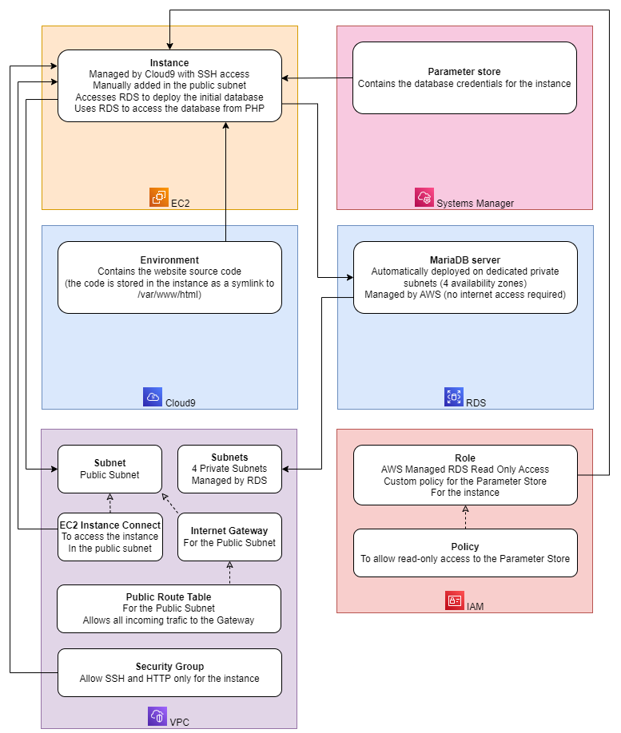

# All the screenshots are sorted in chronological order

- We start by [creating a VPC](Screenshot%202023-07-12%20at%2012.01.54.png) to connect the site and the database on an isolated network. We choose to set the IPv4 to 10.0.0.0/16.
- We [add a subnet](Screenshot%202023-07-12%20at%2012.02.39.png) to the VPC named "Public Subnet" with the IPv4 to 10.0.0.0/24, then we [edit his settings](Screenshot%202023-07-12%20at%2012.03.03.png) to enable auto-assign public IPv4 address. This subnet will be used for the site to be accessible from the internet.
- We [create an internet gateway](Screenshot%202023-07-12%20at%2012.03.44.png) and [attach it to the VPC](Screenshot%202023-07-12%20at%2012.04.03.png). It will allow the VPC to connect to the internet.
- We [create a route table](Screenshot%202023-07-12%20at%2012.04.58.png) and attach it to the VPC. We edit the route table to add a route to the internet gateway from anywhere (0.0.0.0/0). This will allow the VPC to be reachable via the internet through the internet gateway.
- We [create a security group](Screenshot%202023-07-12%20at%2012.12.56.png) for the site. We allow the inbound traffic from anywhere on the port 80 (HTTP) and 22 (SSH). We keep allow the outbound traffic to anywhere on any port. This helps to secure the site by only allowing the traffic on the port 80 and 22, to access website and manage the instance remotely.
- Then we [create a Cloud9 environment](Screenshot%202023-07-12%20at%2012.17.18.png) to develop the site. It is going to create an EC2 instance with the Cloud9 IDE installed. We choose the t2.micro instance type and a Secure Shell (SSH) using the vpc and the public subnet we created earlier. We keep the default settings for the rest of the configuration.
- We [connect to the Cloud9 IDE](Screenshot%202023-07-12%20at%2012.18.44.png) and install the [PHP module](Screenshot%202023-07-12%20at%2012.21.29.png) and the [mariaDB server](Screenshot%202023-07-12%20at%2012.21.58.png) to be able to run the site.
...

Here a recap of the commands:
```
sudo yum -y update
sudo amazon-linux-extras install -y lamp-mariadb10.2-php7.2 php7.2
sudo yum install -y httpd mariadb-server
sudo chkconfig httpd on
sudo service httpd start
cd /home/ec2-user/environment
wget https://aws-tc-largeobjects.s3.us-west-2.amazonaws.com/CUR-TF-200-ACACAD-2/21-course-project/s3/Countrydatadump.sql
ln -s /var/www/ /home/ec2-user/environment/
sudo chown -R ec2-user:ec2-user Countrydatadump.sql
cd /var/www/html
wget https://aws-tc-largeobjects.s3.us-west-2.amazonaws.com/CUR-TF-200-ACACAD-2/21-course-project/s3/Example.zip
sudo unzip Example.zip -d /var/www/html/
sudo chown -R ec2-user:ec2-user /var/www/html
```

From here, we make some changes like the [security group on the instance](Screenshot%202023-07-12%20at%2012.33.00.png) we forgot to give earlier. We decide to add the one we created earlier without removing the default one.
Now we can [access to the site](Screenshot%202023-07-12%20at%2012.34.29.png) by clicking "open address", and tadam!


## And here is the schema of the deployment infrastructure


